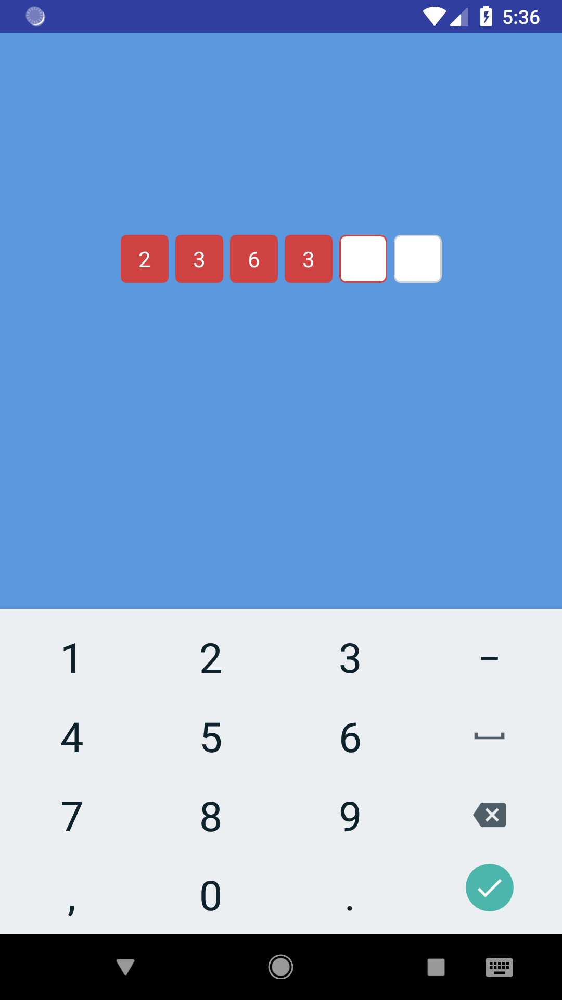
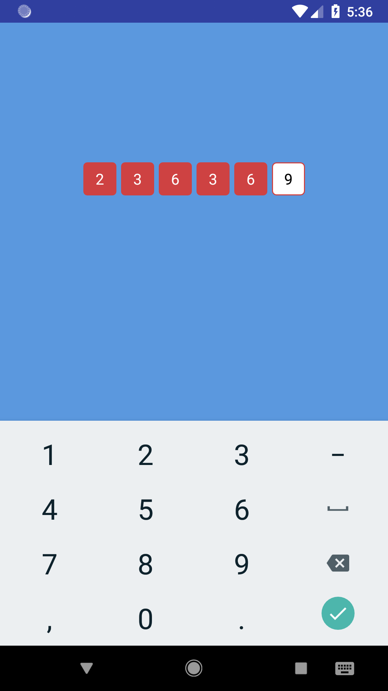

[](https://jitpack.io/#frhnfrq/PinView)

# PinView 

A `PinView` library for Android. To enter pin/otp.




## Setup

Add it in your **root** build.gradle at the end of repositories:

```groovy
allprojects {
    repositories {
		...
		maven { url 'https://jitpack.io' }
	}
}
```

Add `implementation 'com.github.frhnfrq:PinView:1.0'` into **dependencies** section of your **module** build.gradle file. For example:

```groovy
dependencies {
    implementation 'com.github.frhnfrq:PinView:1.0'
}
```
## Usage

#### Add `MathView` in your layout

```xml
<xyz.farhanfarooqui.pinview.PinView
        android:layout_width="wrap_content"
        android:layout_height="wrap_content"
        app:pBackground="@drawable/background_pin"
        app:pBackgroundFilled="@drawable/background_pin_filled"
        app:pCount="6"
        app:pSize="35dp"
        app:pGap="5dp"
        app:pTextColorSelected="#000000"
        app:pTextColor="#FFFFFF"
        app:pTextSize="16sp"
        app:pFont="montserrat.otf"/>
```

#### Get an instance of it in your code
```java
PinView pinview = findViewById(R.id.pinview);
String pin = pinview.getPin();
if (pin == null) {
    // all fields are not filled
} else {
    // your code
}

// you can also manually set a pin
pinview.setPin("123456"); // the length must match pin count
```


## Attributes

* **pCount** : Length of your pin code.
* **pSize** : Height and width of each pin field.
* **pGap**, : Gap between each pin field.
* **pTextSize** : Text size of each pin.
* **pTextColor** : Text color of each pin.
* **pTextColorSelected**, Text color of the selected pin field.
* **pFont** : Name of the font file in your assets/fonts .directory (with extension).
* **pBackground** : Background drawable for pin field.
* **pBackgroundFilled** : Background drawable for pin field when it's filled.

## Custom Background Drawable examples

### pBackground
* **background_pin.xml**
```xml
<selector xmlns:android="http://schemas.android.com/apk/res/android">
    <item android:drawable="@drawable/background_pin_normal" android:state_focused="false" />
    <item android:drawable="@drawable/background_pin_focused" android:state_focused="true" />
    <item android:drawable="@drawable/background_pin_normal" />
</selector>
```

* **background_pin_normal.xml**
```xml
<shape xmlns:android="http://schemas.android.com/apk/res/android">
    <solid android:color="#FFFFFF" />
    <corners android:radius="4dp" />
    <stroke
        android:width="1dp"
        android:color="#CFCFCF" />
</shape>
```

* **background_pin_focused.xml**
```xml
<shape xmlns:android="http://schemas.android.com/apk/res/android">
    <solid android:color="#FFFFFF" />
    <corners android:radius="4dp" />
    <stroke
        android:width="1dp"
        android:color="#ce4242" />
</shape>
```
### pBackgroundFilled

* **background_pin_filled.xml**
```xml
<shape xmlns:android="http://schemas.android.com/apk/res/android">
    <solid android:color="#ce4242" />
    <corners android:radius="4dp" />
</shape>
```


License
=======

    MIT License

    Copyright (c) 2018 Farhan Farooqui

    Permission is hereby granted, free of charge, to any person obtaining a copy
    of this software and associated documentation files (the "Software"), to deal
    in the Software without restriction, including without limitation the rights
    to use, copy, modify, merge, publish, distribute, sublicense, and/or sell
    copies of the Software, and to permit persons to whom the Software is
    furnished to do so, subject to the following conditions:

    The above copyright notice and this permission notice shall be included in all
    copies or substantial portions of the Software.

    THE SOFTWARE IS PROVIDED "AS IS", WITHOUT WARRANTY OF ANY KIND, EXPRESS OR
    IMPLIED, INCLUDING BUT NOT LIMITED TO THE WARRANTIES OF MERCHANTABILITY,
    FITNESS FOR A PARTICULAR PURPOSE AND NONINFRINGEMENT. IN NO EVENT SHALL THE
    AUTHORS OR COPYRIGHT HOLDERS BE LIABLE FOR ANY CLAIM, DAMAGES OR OTHER
    LIABILITY, WHETHER IN AN ACTION OF CONTRACT, TORT OR OTHERWISE, ARISING FROM,
    OUT OF OR IN CONNECTION WITH THE SOFTWARE OR THE USE OR OTHER DEALINGS IN THE
    SOFTWARE.
